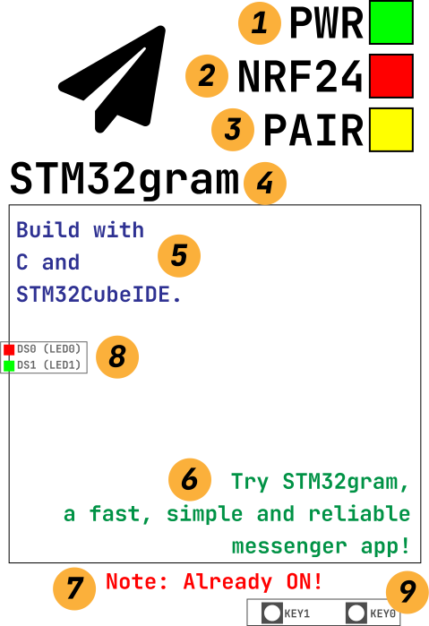
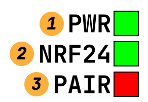
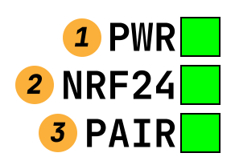

# STM32gram Report

**GROUP 23**

11812418 樊青远

11812419 江宇辰

11812420 黎原朝

11810818 袁通

## Introduction

STM32gram is a fast, simple and reliable communication system that runs on STM32mini develop board. Written in C language, the program is compiled by STM32CubeIDE with its own `arm-elf-gcc` compiler.  The whole program could theoretically run on any [STM32F103](https://www.st.com/en/microcontrollers-microprocessors/stm32f103.html) board with a [NRF24L01wireless module](http://www.openedv.com/posts/list/3191.htm) and a LCD display.

## Interfaces

### Input Device

STM32gram uses serial communication port as the input of chatting content, and two key buttons on the STM32 board to switch on and off the device. The `key1` device is used to switch on the device, and `key0` is used to switch off the device. Press a key multiple times won't change the the power status of the device.

### Transmit Device

The device use a extension module named "NRF24L01" to transmit the data from SPI to 2.4GHz electromagnetic wave. 

### Output Device

The device contains a LCD display to display the relevant system information of the board, the NRF24L01 module and the serial COM. It also display the text the device received by COM and 2.4G transmission signal.

## Display

The following figure is a sample interface of the LCD display on STM32 board.



The function of each sign is as follows:

1. The power indicator.
2. Status indicator of `NRF24`.
3. Status indicator of the pairing with another device.
4. Title of STM32gram.
5. Sent message.
6. Received message.
7. Warn placeholder.
8. LED (Not shown on the real display).
9. KEY (Not shown on the real display).

## Usage

### Compile

Click `run` button to compile the program and write it into the board.


### Preparation

Plug in the `NRF24` module and display module.

### Power on device

Power on the board and press `KEY0`. if you have correctly installed the `NRF24` module, you could find that the `PWR` indicator and `NRF24` indicator have been turned to green.



### Pair the device

Open another board, wait for about five seconds, after `LED1` blink once, the `PAIR` indicator should be turned to green. The green icon indicates that the device has been paired.



If you continue to press  `KEY1`, an warning message will shown on the bottom of the screen to remind you that the device has been turned on.

### Send the message

To send message, open the serial communication software on your computer and set the baud rate at `115200`. Send the message and use `\n` to tell the board to send it out. If the message has been successfully sent, you can view it on the right lower corner of the frame **(6)**. 

### Receive the message

To receive the message, keep an eye on the left upper side of the frame to view the new message. The new message is shown in blue color **(5)**. 

If the connection closed unexpectedly, the `PAIR` indicator will turn back to red, and an error message will display on the bottom of the display.

### Power off the device

To power off the device, press `KEY0`, the `PWR` indicator will be turned to red. If you contiune pressing `KEY0`, an error will occured on the botton of the display to prevent you to do so.

## Idea of design

We firstly include the HAL library for the SPI interface, LCD screen, KEY and NRF24L01 transmission module.

```c
#include "led.h"
#include "key.h"
#include "lcd.h"
#include "24l01.h"
```

### Status indicator

We designed three functions to show the indicator on the right upper position of the display.

The function for the  `PAIR` indicator is shown below:

```c
int diaplay_connection_status(on){
	POINT_COLOR = BLACK;
	LCD_ShowString(display_frame_right-78 ,40+6+24, 78, 24, 24, "PAIR");
	if (on == 1){
		LCD_Fill(display_frame_right-24,40+6+24,display_frame_right,40+24+6+24,GREEN);
	} else if (on ==0){
		LCD_Fill(display_frame_right-24,40+6+24,display_frame_right,40+24+6+24,RED);
	} else {
		LCD_Fill(display_frame_right-24,40+6+24,display_frame_right,40+24+6+24,YELLOW);
	}
	LCD_DrawRectangle(display_frame_right-24,40+6+24,display_frame_right,40+24+6+24);
}
```

### Power on and connect after the key pressed

After the `KEY0` pressed, the LED0 (the red one) will turn to red, and the `PWR` indicator icon on the screen will be turned to green. After that, the mesaage frame of the LCD screen will be flushed to white for further use.

```c
	if (key == KEY0_PRES && !isOn) {
		isOn = 1;
		LED0 = !LED0;
		POINT_COLOR = BLACK;
		LCD_Fill(display_frame_left+1, display_frame_upper+1, display_frame_right-1, display_frame_lower-1, WHITE);//CLEAN the note2
		diaplay_power_icon(1);
		NRF24L01_RX_Mode();
		return 1;//on
```

### Establish the connection

**To establish and verify the connection, we send an array filled with "TEST0" periodically to verify the connection.** This process is quite similar to the "heartbeat message" concept in other communication field. The heartbeat packet will be identify by the board and will not shown on the screen.

```c
test[0]='T';
test[1]='E';
test[2]='S';
test[3]='T';
test[4]=0;
```

We use an timer to count an period with a length of 5s. at the end of every period, the `LED1` will blink once and each board will send an `TEST0` packet to verify the connection status. If the board has received the `TEST0` packet, the `PAIR` indicator will turned to green, if not, the `PAIR` indicator will turned to red.

```c
if (t == 60000){
	NRF24L01_TX_Mode();
	LED1=!LED1;
	if(NRF24L01_TxPacket(test) != TX_OK){
		diaplay_connection_status(0);
	}else{
		diaplay_connection_status(1);
	}
	LED1=!LED1;
	NRF24L01_RX_Mode();
	t = 0;
}
```

### Send and receive the message

The board will store the message inputed from the serial COMM until receive a `\n` at the end of the buffer. After receiving it, the `HAL_UART_RxCpltCallback` function will called the `NRF24L01` module to send the packet and display it on the screen with green colour.

```c
void HAL_UART_RxCpltCallback(UART_HandleTypeDef *huart) {
	if (huart->Instance == USART1) {
		static unsigned char uRx_Data[1024] = { 0 };
		static unsigned char uLength = 0;
		if (rxBuffer[0] == '\n') {
			HAL_UART_Transmit(&huart1, uRx_Data, uLength, 0xffff);
			if(getCommand(uRx_Data,uLength)==0){
				if(!isOn){
					POINT_COLOR = RED;
					LCD_Fill(30, 295, 230, 295 + 16, WHITE);
					LCD_ShowString(30, 295, 200, 16, 16, "NOTE: Turn on first!");
				}else{
					if(uLength>=33){
						POINT_COLOR = RED;
						LCD_Fill(30, 295, 230, 295 + 16, WHITE);
						LCD_ShowString(30, 295, 200, 16, 16, "NOTE: Input <= 32!");
					}else{
						for(int i = 0;i<1024;i++){
							if(i==uLength) {
								send_buf[i]=0;
								break;
							}
							send_buf[i]=uRx_Data[i];
						}
						isChanged = 1;
					}
				}
			}
			uLength = 0;
		} else {
			uRx_Data[uLength] = rxBuffer[0];
			uLength++;
		}
	}
}
```

After received the packet, the function above will display the received message on the upper left position of the display with in blue.

**Any buffer with a length more than 32 byte will be dropped and the board will display a warning about the exceed length of the TX/RX buffer.**

## Conclusion

By using HAL Library and NRF module in this project, we gain much more knowledge about 2.4G data transfer. At first, we even didn't know how NRF24 module works on board. We searched many resources to have a brief knowledge on it and try to connect it with our board using knowledge from labs. Also, we can't achieve transmitting when we apply NRF24 module the first time. Some constraints were defined to solve the problem. Although meeting some bugs when we are developing, we tried our best to fix them and thanks to all folks who gave us help. 

## Division of work

樊青远：Code for display the status on the screen and control the pair of the board.

黎原朝：Code for Send & Receive part between the board and the HAL Library.

江宇辰：Code for Send & Receive part between the board and the HAL Library.

袁通：Conclude and write the document, report and PPT.

## Thanks to 

Group 25（CHEN Jiyuan, Peng Ruidi and others) : Thanks for their help about UI design method. They helped us locating message block in right position.

Group 3 11811418 谢锐， 11810820 张宏彬， 11811405 高圣迪， 11811412 梅杰： Thanks for their help about UI design on how to show different mode on screen.

Group 15 11813015 徐承启， 11813006 黄浩， 11813011 封霆谚， 11813002 王宇杉: Thanks for their help about connecting 2.4G module between boards.

